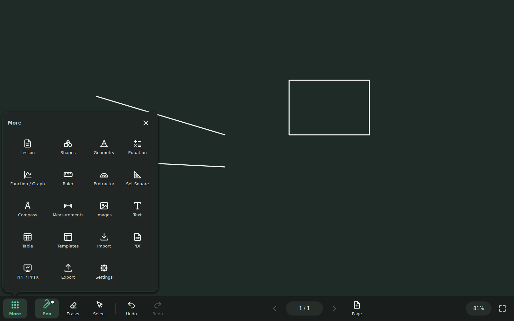
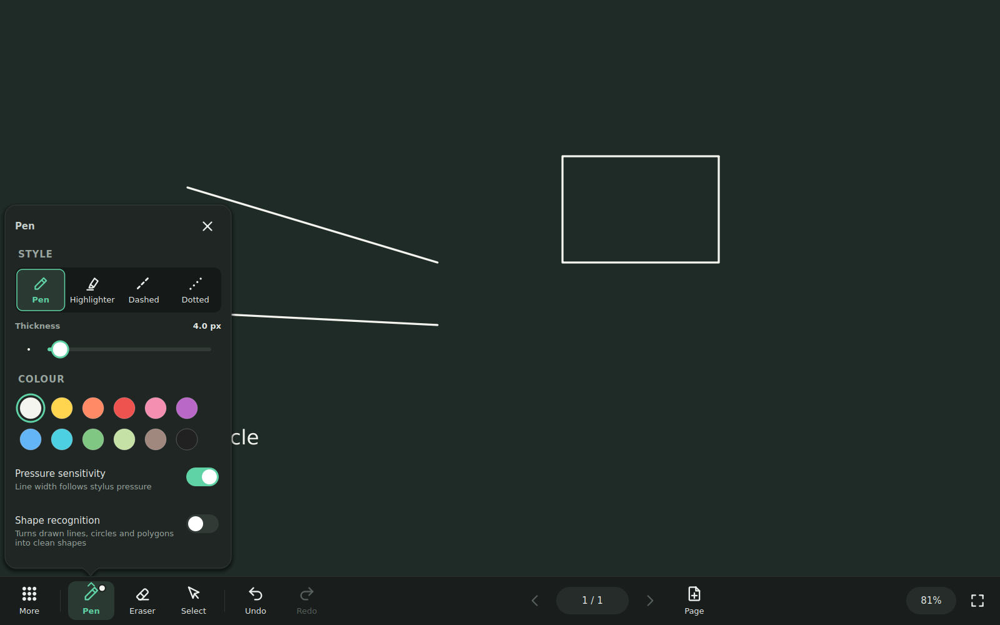
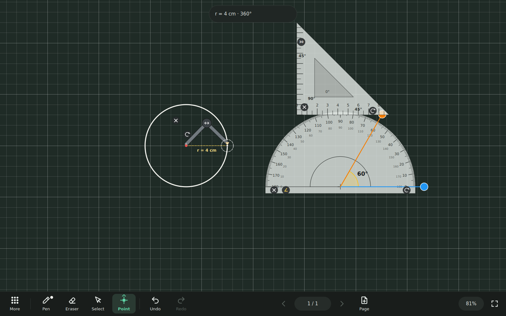
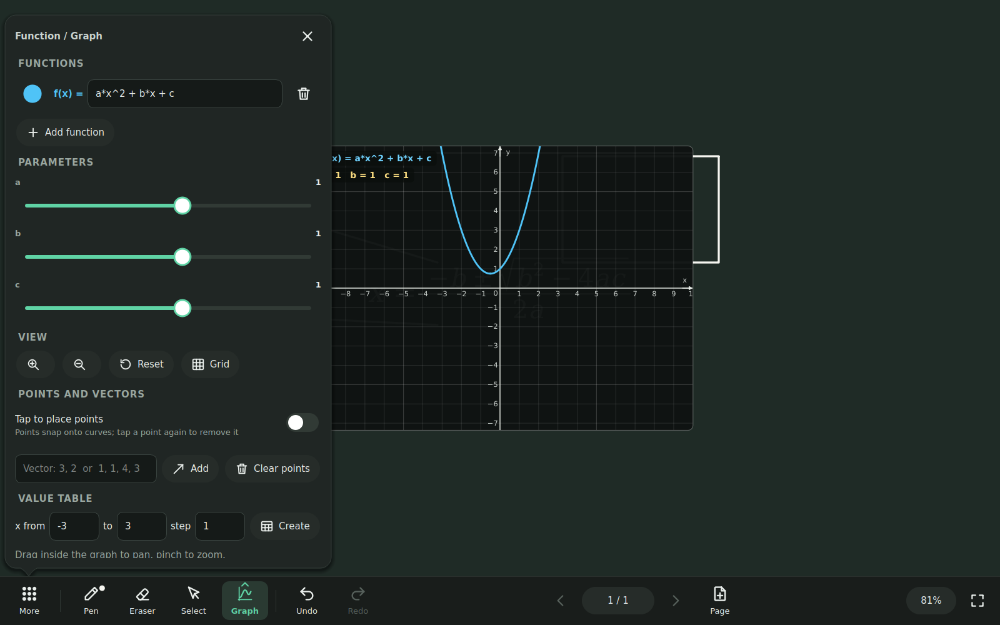

# ClassBoard

ClassBoard is an open-source digital whiteboard for large interactive classroom displays.
It is written in C++17 with Qt 5.15, targets Windows 10/11, and works fully offline.

The board fills the screen. The most-used commands sit in a ribbon along the bottom, and the
rest open as popovers attached to the button that opened them, so you stay on the board.



## Features

| Area | What you get |
|---|---|
| **Ink** | Smooth pen, highlighter, dashed and dotted ink. Stylus pressure. Several people can draw at the same time (optional). Optional shape recognition. |
| **Eraser** | Stroke, object and area modes. The area eraser rubs out exactly the ink under it. Wipe with four fingers or the flat of your hand at any time. |
| **Select** | Tap, rectangle or lasso selection, including multi-select. Move, resize, rotate and edit points. A floating action bar offers edit, colour, arrange, duplicate, copy and delete. |
| **Shapes** | Line, arrow, double arrow, rectangle, rounded rectangle, circle, ellipse, triangle, right triangle, diamond, parallelogram, hexagon, regular polygon and free polygon. Fill is none, tint or solid. |
| **Instruments** | Ruler (draw along its edges), protractor with measuring arms and an angle stamp, 45° and 30/60° set squares, and a compass that draws arcs and circles. |
| **Geometry** | Distance, angle, slope and area measurements that update live. Points with coordinates, segments, lines, rays and vectors. Snapping to points and to the grid. |
| **Precision** | Exact values next to dragging: line length, direction, angle, rise / run / slope, vector magnitude and direction, shape width / height with area and perimeter. A drawing scale such as 10 cm = 1 km shows real lengths, areas and vectors. |
| **Equations** | LaTeX-style input with a symbol palette and a live preview. Supports fractions, roots, powers and indices, integrals, sums, limits, vectors, matrices, cases and Greek letters. Equations stay editable. The optional ✨ Magic Equation Maker turns selected handwriting into an equation after the teacher accepts a preview (offline). |
| **Graphs** | Plot several functions with automatic parameter sliders (a, b, c …), zoom and pan, points that snap onto curves, vectors and value tables. |
| **Pages** | Page menu with New, Duplicate, Clear and Delete page. Page navigator with thumbnails; drag to reorder, rename. Page sizes 16:9, 4:3, A4, A3 or custom; background colour per page. Templates: blackboard, whiteboard, grid, dots, ruled, graph paper, music staves, coordinate plane, or your own image. |
| **View** | Zoom 25 %–250 % presets, zoom in / out, 100 %, fit page, fit width, full screen. Zoom never changes sizes, measurements or exports. |
| **Content** | Text boxes with basic formatting, images (drag and drop, paste, import), tables. |
| **Files** | Versioned `.classboard` lesson format with atomic saves, autosave and crash recovery. |
| **Export / import** | Vector PDF with real text (each page at its own size), PowerPoint `.pptx` and PNG, always of the complete page. Imports images, pages from other lessons, PDFs (every page keeps its size and aspect ratio) and PowerPoint `.ppt` / `.pptx` (every slide becomes a page). See [import requirements](docs/BUILDING.md#import-requirements). |

There is one undo/redo history for every tool, and undo jumps to the page it changes.

| Pen popover | Instruments | Graph |
|---|---|---|
|  |  |  |

## Building

Requirements: CMake ≥ 3.16, a C++17 compiler (MSVC 2019/2022, GCC 9+ or Clang 10+), and
Qt 5.15 with the Widgets and Svg modules.

```bash
cmake -S . -B build -G Ninja -DCMAKE_BUILD_TYPE=Release
cmake --build build
ctest --test-dir build --output-on-failure     # unit and integration tests
./build/bin/ClassBoard                          # build\bin\ClassBoard.exe on Windows
```

[docs/BUILDING.md](docs/BUILDING.md) covers step-by-step Windows instructions, deployment with
`windeployqt` and building the installer.

## Documentation

* [User guide](docs/USER_GUIDE.md): gestures, tools and keyboard shortcuts
* [Architecture](docs/ARCHITECTURE.md): modules, data flow and design decisions
* [File format](docs/FILE_FORMAT.md): the `.classboard` container and its JSON schema
* [Building and packaging](docs/BUILDING.md)

## Project layout

```text
src/
  app/        main window, controllers (lesson, export, popovers), settings
  core/       geometry helpers, ids, JSON helpers, CRC32
  document/   document model, pages, objects, commands (undo/redo), templates, images
  canvas/     canvas widget, renderer, view transform, thumbnails
  input/      mouse / touch / stylus abstraction and gesture recognition
  tools/      pen, eraser, select, shape, text, measure, construct and graph tools
  geometry/   instruments, measurement and construction objects
  math/       coordinate system, expression engine, equation typesetter
  graph/      function graph and table objects
  ui/         theme, icons, popover system, ribbon, widgets, popover panels
  export/     PDF, PPTX, PNG exporters, ZIP writer
  storage/    container format, serializer, autosave / recovery, PDF import
  ai/         shape recognizer, recogniser plug-in interfaces
tests/        Qt Test suites (core + UI integration)
resources/    icons, themes, templates, application icon
```

## License

MIT. See [LICENSE](LICENSE).
